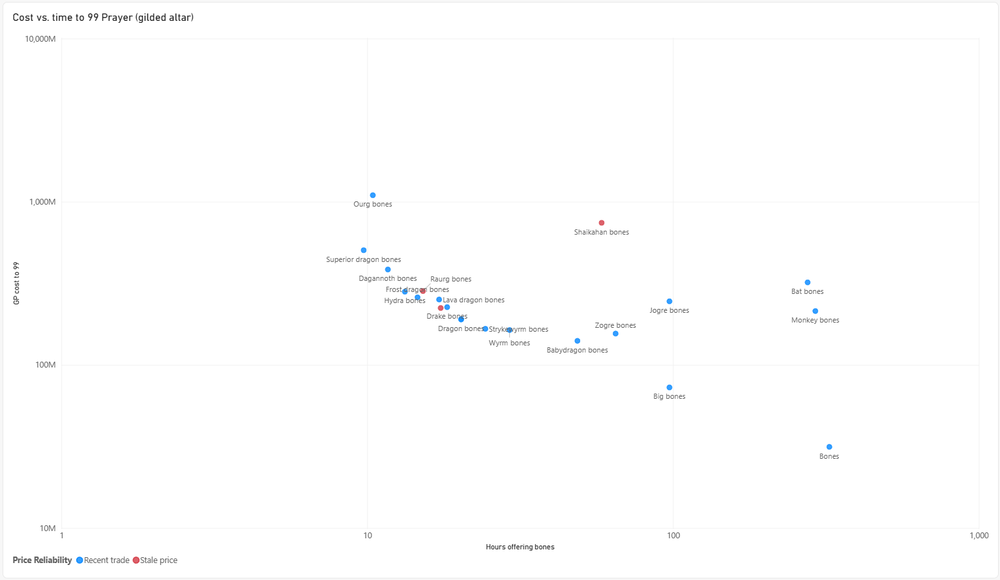

# OSRS: What's the cheapest way to buy 99 Prayer?

Prayer is trained by buying bones and offering them at an altar.
Cheaper bones give less XP each, so the real question is a tradeoff
between GP spent and hours spent.

## Data
- Live Grand Exchange prices from the OSRS Wiki real-time prices API
  (1-hour averages, with trade volume)
- Base XP per bone scraped from the wiki's Pay-to-play Prayer training page
- Assumes level 1 to 99 (13,034,431 XP), gilded altar (3.5x), 2,550 bones/hour

## Findings
- Regular bones are cheapest per XP (~8 GP/XP) but need ~325 hours of
  offering and ~46 days just to buy within GE limits
- Dragon bones: ~189M GP, ~20 hours
- Superior dragon bones: ~497M GP, ~10 hours
- Dragon -> Superior costs ~307M more to save ~10 hours: worth it only if
  you earn more than ~29M GP/hour
- Several bones (Wyvern, Drake, Jogre, Monkey, Bat) are dominated:
  slower AND more expensive than an alternative
 

## Data quality
- Raurg, Fayrg, and Shaikahan bones had no trades in the last hour and
  prices 11-19 hours old. Flagged as "Stale price" and excluded from the
  efficient-frontier calculation.
- Strykewyrm bones has no buy limit in the API's item mapping, so days of
  buying can't be computed for it.

## Run it
pip install -r requirements.txt
python get_prayer_xp.py    # once, saves data/prayer_xp.csv
python prayer_costs.py     # rebuilds data/prayer_cost_vs_time.csv